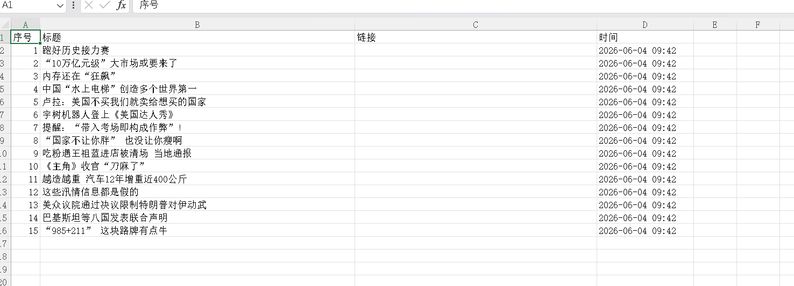

# RPA Selenium Automation — 网页自动化采集

> 个人项目 | Python + Selenium 模拟 RPA 网页采集流程 | Chromium Headless + xvfb

## 项目简介

使用 Selenium + Chromium 实现网页数据自动采集，模拟影刀 RPA 的核心能力：启动浏览器 → 打开网页 → 定位元素（CSS Selector）→ 提取数据 → 导出 Excel。支持无头模式（Headless）和虚拟显示器（xvfb），可在无 GUI 的 Linux 服务器上运行。

## 架构流程

```
① 启动浏览器 → ② 打开网页 → ③ 定位元素 → ④ 提取数据 → ⑤ 异常跳过 → ⑥ 导出Excel
  Chromium      driver.get   CSS Selector  .text/.href   try/except    openpyxl
  Headless+xvfb              多选择器兜底                元素不存在不崩   格式化报表
```

## 技术栈

**Python · Selenium · Chromium · xvfb · openpyxl · CSS Selector**

## 效果截图

### Selenium 运行结果
服务器上 xvfb-run 启动 Chromium Headless，成功采集百度热搜/新闻数据并导出 Excel。



## 项目结构

```
RPA-selenium-automation/
├── scraper.py              # 核心采集脚本
├── scraper_result.xlsx     # 采集结果示例
├── images/
│   └── Selenium.png        # 运行截图
└── README.md
```

## 核心功能

- **多选择器兜底**：配置多个备选 CSS Selector，主选择器不命中自动切换
- **Headless 模式**：无头浏览器 + xvfb，不依赖图形界面，服务器可运行
- **异常自动跳过**：单个元素定位失败不影响整体流程（try/except），不是一次性脚本
- **格式化 Excel 导出**：openpyxl 生成带列宽样式的报表

## 快速启动

```bash
# 1. 装依赖
apt install -y chromium-browser chromium-chromedriver xvfb
pip3 install selenium openpyxl

# 2. 运行
xvfb-run python3 scraper.py

# 3. 查看结果
# 双击打开 scraper_result.xlsx
```

## 与影刀 RPA 的对应关系

| RPA 环节 | 本项目实现 |
|------|------|
| 打开浏览器 | `webdriver.Chrome()` |
| 打开网页 | `driver.get(url)` |
| 等待加载 | `time.sleep(3)` |
| 元素定位 | `driver.find_elements(By.CSS_SELECTOR, selector)` |
| 提取文本 | `element.text` |
| 提取链接 | `element.get_attribute("href")` |
| 数据导出 | `openpyxl.Workbook()` |
| 异常处理 | `try/except` |

## 面试可讲

- Selenium + BeautifulSoup 双方案互补：静态页面用 requests+BS4 更快更省，动态 JS 用 Selenium
- CSS Selector 元素定位和影刀 RPA 底层原理一致
- 在阿里云 ECS 上跑 xvfb + Chromium Headless，实现无 GUI 自动化
- 多选择器兜底策略证明考虑过反爬和页面结构变化的健壮性

## License

MIT
